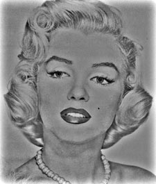
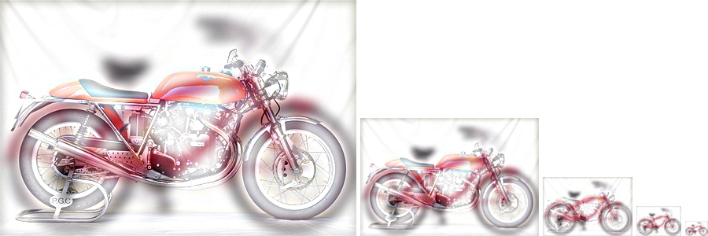

# 王尊玄 <span style="color:red">(102061210)</span>

# Project 1 / Image Filtering and Hybrid Images

## Overview
The project is related to 
> Mixing two images into a hybrid image which constitues of high frequency components of one image and low frequency components of the other. We can see both original images when our viewpoints zoom in and out.

## Implementation
1. Implement our own filter function ```my_imfilter.m```
	* input an image with full channels and a filter, output a filtered image with full channels
	* perform zero padding over input image for every channels
	* for every pixel, do filtering
	```
	****** PSEUDO-CODE ******
	Subroutine my_imfilter(image, filter):
	zero padding on image (adding (filter_size-1)/2 0's on 4 sides of the image)
	loop i over image height
		loop j over image width
			ROI = cropped image with shape=filter_size centered at (i,j)
			img_filtered(i,j) = sum of element-wise multiplication of ROI and filter
	return img_filtered
	```
	* Also, we need to check channels of the image and do corresponding process to handle color image and gray image input.
	
2. Extract high/low frequency components
	* construct a Gaussian filter
	* apply Gaussian filter to images to extract low frequency components, constructing low pass filtered images
	* subtract Gaussian filtered images from identity images to get images only with high frequency components, approximating a Laplacian filter <br />
	
	
	```
	>> filter = fspecial('Gaussian', cutoff_frequency*4+1, cutoff_frequency);
	>> low_frequencies = my_imfilter(image1, filter);
	>> high_frequencies = image2 - my_imfilter(image2, filter);
	```

3. Construct hybrid images
	* respectively add up R, G, B values of high and low frequency images for every pixel
	```
	>> hybrid_image = low_frequencies + high_frequencies;
	```

## Prerequisite
[Matlab](https://www.mathworks.com/products/matlab/) <br />

## How to run
Go to root_directory_of_this_repo/code, you can show and save low frequency image, high frequencyimage, hybrid image, and that with different scales by running ```proj1.m```. Besides, you can get andsave blur image, large blur image, sobel image, laplacian image, and high pass image by running file ```proj1_test_filtering.m```. <br />

## Results
|High-frequency|Low-frequency|Hybrid Image|With different scales|
|---|---|---|---|
|||||
|||||
|||||
|||||
|||||

We can see from hybrid images with different scales that if we look at images with larger scales, we can obseve much more details and high frequency components will dominate in our comprehension of those images, i.e. the hybrid images will be like high frequency images in the above table. On the other hand, if we are looking at images with smaller scales, details, which may be high frequency components, may not be easily observed, and thus, the hybrid images in smaller scales will look like low frequency images in the table.
