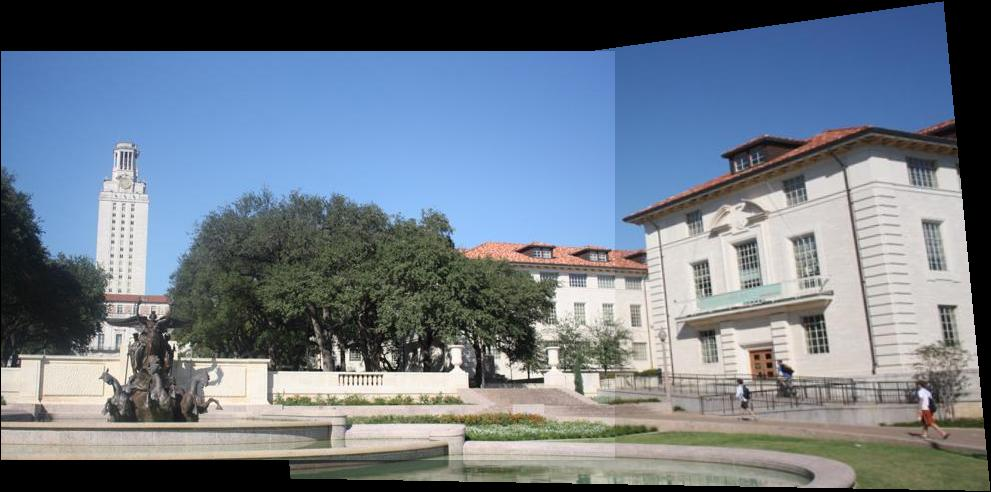
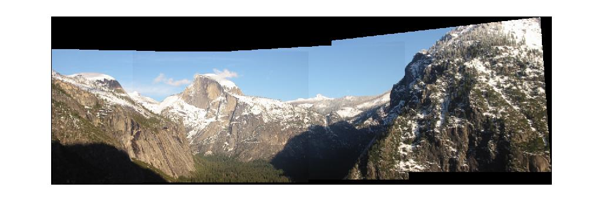
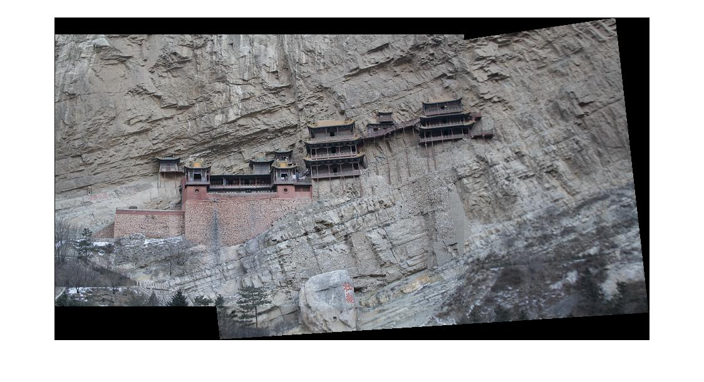

# 王尊玄 <span style="color:red">(102061210)</span>

# Project 2 / Panorama Stitching

## Overview
The project is related to 
> automatically stiching a set of images to form panoramatic images given no camera translation within the source images. Projective matrices within pairs of images is modeled as affine and homography matrices. Furthermore, bundle adjustment is implemented to cope with a set of images which may construct more than 1 panorama, and may not be in order.


## Implementation
1. Feature Extraction
	* we use [SIFT](http://www.cs.ubc.ca/~lowe/papers/ijcv04.pdf) (Scale Invariant Feature Transform) descriptors
	* a 3rd party package "vlfeat" do the job of detecting key points and extracting features (descriptor) from an image
	
2. Matching
	* the most intuitive and simple matching method is used, which exhaustively computes all pairs of points and finds qualified matches from a given threshold
	* this implementation can be found in "SIFTSimpleMatcher.m"
	
3. Transformation model
	* affine transformation: with 6 DOF(degree of freedom), is able to model translation + rotation + 
scale + aspect ratio + shear. DO NOT possess full capability of 2D transformation. It is solved as linear system analytical solution. The implementation can be found in "ComputeAffineMatrix.m" <br />
	
	* projective transformation (homographies): with 8 DOF, is able to model affine transformation + distortion. A more powerful choice than affine transformation and can solve problems out of affine transformation capability. It is solved as analytical solution using SVD, described in this [essay](https://cseweb.ucsd.edu/classes/wi07/cse252a/homography_estimation/homography_estimation.pdf). Otherwise, it can be solved as numerical solution using iterative method. Both algorithms can be found in "ComputeHomoMatrix.m" <br />
	
	
4. RANSAC (RANdom SAmple Consensus)
	* given a set of matches, randomly picks a subset of matches, constructs a model using the subset, check if the model fittable for the matches exclusive of the subset, and finally, if we get a valid model, refine(recompute) the model using all inliers, which may contains the subset of matches and part of matches exclusive of the subset
	* for more details, go to [RANSAC](https://en.wikipedia.org/wiki/Random_sample_consensus)
	* this implemenation can be found in "RANSACFit.m"
	
5. Bundle Adjustment
	* my implementation of bundle adjustment accept incremental feeds of input images. Outermost procedure is shown as,
	```
	********* PSEUDOCODE *********
	BA = my bundle adjustment object
	BA initialized with 2 or 3 images as input
	loop through a image set:
		BA.update(new_image)
	```
	* for every update, descriptors and matches corresponding to the new input image is computed. Note that descriptors and matches of previous images were stored and don't need to recompute.
	* for RANSAC in bundle adjustment, each model is first constructed by a match and validity of the constructed model is evaluated over that match, independent of other matches (no joint process here). Then, if the model is valid, inliers corresponding to the match are collected. After inliers corresponding to every match are collected, bundle adjustment is performed (joint process starts here)
	* for every update, inliers corresponding to previous matches are fixed, which means that RANSAC only accounts for finding inliers of matches associated with new input image
	* optimization of bundle adjustment is performed jointly over all matches. The objective function is , where n is the number of images,  is the set of images matching to image i,  is the set of feature matches between image i and j, r is the residual error, and h(·) is Huber robust function . This nonlinear system minimization probelm with least square error sense is solved by iterative method [Levenberg–Marquardt](https://en.wikipedia.org/wiki/Levenberg%E2%80%93Marquardt_algorithm) using matlab function [lsqnonlin](https://www.mathworks.com/help/optim/ug/lsqnonlin.html)
	* from my experiment, I found that if we directly solve the objective function with non-well-determined initial guess, it is very likely to fall into local minimum, which may be incorrect. Thus, in an update, for previous matches, initial guess of solution is set to solution of last update. On the other hand, for matches associated with new image, initial guess is set to pairwise solution of two matched images, which is simply the homography of regular 2-image stitching 
	* for more details, go to [Automatic Panoramic Image Stitching using Invariant Features
](http://matthewalunbrown.com/papers/ijcv2007.pdf)
	* this implementation can be found in "increBA_computeH.m"

6. Multiple stitching
	* If we have a set of projective matrices defined over a set of out-of-order images which may construct more than 1 panorama, the given code "MultipleStitch.m" will fail. Hence I implemented my own multiple stitching method.
	* a set of projective matrices corresponding to out-of-order matches may contain information of constructing numerous panorama. In order to seperate all independent matches(not in the same panorama), [graph traverse](https://www.mathworks.com/help/bioinfo/ref/graphtraverse.html) algorithm is carried out iteratively to obtain numerous independent matches sets. For each iteration, a set of matches(projective matrices) is extracted from the entire set, defined as a graph. 
	* After we get several independent sets of matches which, with images, define different panoramas, for each panorama, we [find the shortest path](https://www.mathworks.com/help/bioinfo/ref/graphshortestpath.html) to reference node (image) and compute transformation matrices from all non-reference images to the reference image.
	* For each panorama, we can stitch all images. Finally, we can get several panoramas according to the set of out-of-order images
	* this implementation can be found in "myMultipleStitch.m"

## Installation
[VLFeat 0.9.17 binary package](http://www.vlfeat.org/download.html), only ```vl_sift``` function is used.

## How to run
1. If you are not going to use bundle adjustment, just follow the instructions from this homework
2. If you want to try out my bundle adjustment implementation, you can trace code "myMultipleStich.m", which is an easy example using my implementation

## Results
#### Difference between affine and projective model : <br />
|affine transformation|projective transformation|
|---|---|
|||

We can find that panorama using affine transformation do not stitch 2 images well. It seems like the right image should expand a little bit to well match the left image at the boundary. On the other hand, panorama using projective transformation perfectly solves the glitch, thanking to more degree of freedom, i.e. capability, of the model.

#### Results from ```StitchTester``` : <br />
|yosemite with projective transformation|
|---|
||

The given code after completed brings a pretty good result to create a panorama. However, this can only be done in a very constrained condition, in which the source image set must be feeded into the algorithm in order and only 1 possible panorama can exist at a time. The following results show the performance of my implementation using bundle adjustment, which can deal with panorama stitching in a much more general condition.

#### Results using bundle adjustment :
|out-of-order image set including yosemite, Rainier, MelakwaLake|
|---|
| |
||

|out-of-order image set including Hanging, uttower|
|---|
| |

As shown above, for the first set of images, we use 12 out-of-order images to form 3 panoramas at once. Using my own implementation, we can easily stitch any kinds of image sets to form more than 1 panorama at a time, where the only constraint is that there must be no camera translation over the image sets. 

## Some unsolved glitches 
1. in some rare case, there will be numerical failure in iterative optimization process (Levenberg-Marquardt algorithm).
	* possible solution: set extra constraints within the iterative process
2. in some rare case, computed projective matrices will lead to transformed images "kind of explode" in panorama 
	* possible solution: reparametrize projective matrix models, or set constraints over projective matrices. Perhaps both glitches are actually the same problem.

## Extra Credits
```increBA_computeH.m```, ```computebundleHomo.m```, ```myMultipleStich.m```, ```ComputeHomoMatrix.m``` by TsunHsuang-Wang


