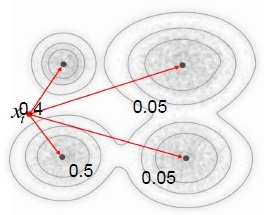
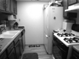
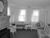
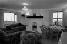

 王尊玄 <span style="color:red">(102061210)</span>
# Project 3 / Scene recognition with bag of words

## Overview
The project is related to
> scene recognition using different features extracted from images and different classifiers. Features used include tiny image features and bag-of-words features. Classifiers used include (K-)nearest-neighbor classifiers and support vector machine (SVM).

## Implementation
- feature extraction:
  1. tiny image: a very simple image representation inspired by [Torralba, Fergus, and Freeman](http://groups.csail.mit.edu/vision/TinyImages/). One simply flattens out a 2D image into a vector, e.g. a 32x32 image can be represented as a 1024 vector. This method may not be suitable for images with larger size since it will produce a very high dimensional feature vectors and bring trouble for training. Besides, tiny image representation may be very sensitive of image augmentation, which implies bad robustness. The code can be found in ```get_tiny_images.m```
  2. bag of words:
    - bag of SIFTs: first we extract dense SIFT descriptors for all images in training set. Then, we use k-means clustering to construct vocabulary of our bag-of-words model. To extract features, we obtain dense SIFTs for an image, and each SIFT is assigned to a vocabulary by finding minimum distance. Finally, after accumulation of all SIFTs over an image, a histogram can be drawn as distribution describing (or representing) the image. Note that we need to normalize the histogram to avoid numerical problems. I use "divided by max" as normalization strategy. The code can be found in ```build_vocabulary.m``` and ```get_bags_of_sifts.m```
    - bag of SIFTs with spatial pyramid: unlike bag of SIFTs where spatial information is lost due to process of constructin histogram, the use of spatial pyramid encode coarse spatial information to the features. We simply obtain histogram over an image at different levels. At i_th level the entire image is divided into 2^(2i-2) blocks. Finally, we concatenate histograms of all blocks at all levels, e.g. with vocabulary size 400, level 3 pyramid, we get features of 400x(1+4+16)=8400 dimensions. Note that no weight is used in histograms at different levels. The code can be found in ```get_sp_sifts.m``` <br />
    <p align="center"></p>
    - Fisher vector with SIFTs: first, we use gaussian mixture model (GMM) to model vocabularies. It is the corresponding step of k-means clustering in bag of SIFTs. After vocabulary constructed, we compute gradient of GMM w.r.t. all mean and variance. This brings 2xMxd dimensions to feature vectors, where 2 means mean and variance, M means number of Gaussian in GMM, and d is the dimension of SIFTs. Fisher vector encode higher order statistics and may decrease information loss, in comparison to loss resulting from accumulation process in constructing histogram. Note that, we better do PCA before using GMM since GMM assume no correlation in covariance matrix of the Gaussian model. The code can be found in ```build_fisher_vocabulary.m``` and ```get_fisher_vector.m```<br />
    <center><table>
    <tr><td><center>GMM</center></td><td><center>Fisher vector</center></td></tr>
    <tr><td></td><td></td></tr>
    </table></center>
    - Fisher vector with PHOWs: almost the same as fisher vector with SIFTs. The only difference is that we replace low-level descriptor SIFT with PHOW, which extract SIFTs at multi-scale, simply dense SIFT applied at several resolutions. The code can be found in ```build_phow_fisher_vocabulary.m``` and ```get_phow_fisher_vector.m```
- classifiers:
  1. nearest neighbor:
    - every training data is stored, called prototype. nearest neighbor classifier compute distance between a test sample to all prototypes and find the closest one from the test sample. Directly assign the class of the closest prototype to the class of that test sample. For K-nearest neighbor (KNN), k closest prototypes are found and vote for the predict class of test samples.
    - only nearest neighbor classifier is implemented. KNN is not. The code can be found in ```nearest_neighbor_classify.m```
  2. support vector machine (SVM): to be brief, SVM is a classifier that seperate data of different classes with a hyperplane, whose objective is to maximize the minimum distance from data to the hyperplane, otherwise known as margin. Also, SVM has a hyperparameter C, which can be adjusted to change tolerance of outliers. Finally, kernel tricks make SVM a very powerful method. As mentioned above, vanilla SVM use a hyperplane to seperate data, implying data must be linear seperable. However, with kernel method nonlinear seperable data can be projected to a higher dimensional feature space and become linear seperable.
    - model of SVM: simply definition of a hyperplane, a normal vector and a bias. For kernel SVM, all vectors on the margin (support vectors) are stored accompanied with there non-zero lagrange mulipliers.
    - multi-class SVM: SVM provided in ```vl_feat``` support only binary class, and thus we need to use binary class SVM to construct a multi-class SVM. I follow 1-vs-all methodology. This can be found in ```svm_classify.m```
    - kernel SVM: ```vl_feat``` do not support kernel method. Thus I use ```libsvm``` for kernel SVM. This can be found in ```kernel_svm_classify.m```
    - linear kernel: at test time, dot product is performed between support vectors test data. Only work for linear seperable data.
    - radius basis function (rbf) kernel: also called gaussian kernel, . At test time, x and x' may be support vectors and test data. Hyperparameter sigma (the same as that of Gaussian distribution) can be adjusted.
    - polynomial kernel: shown as . At test time, x and x' may be support vectors and test data. Degree of polynomial d is a hyperparameter.
    - pyramid matching kernel: described in [Lazebnik et al 2006](http://www.cs.unc.edu/~lazebnik/publications/cvpr06b.pdf) section 3.1. To construct pyramid matching kernel (which is self-defined), I use precomputed kernel of ```libsvm```, which is, from my perspective, a very non-elegant implementation since it does computation explicitly in Matlab script and can be very inefficient. Aside from slow computational time, using pyramid matching kernel doesn't bring better performance (**about 70%, it runs very slow so I do not work on it since I first implemented it**) than linear kernel. I think maybe there are some problems in my implementation. This can be found in ```PMkernel_svm_classify.m```

## Installation
[VLFeat 0.9.17 binary package](http://www.vlfeat.org/download.html) <br />
[libsvm](http://www.csie.ntu.edu.tw/~cjlin/libsvm/) <br />
[textprogressbar](https://www.google.com.tw/?gws_rd=ssl#q=textprogressbar) <br />

## How to run
- in file ```proj3.m```, you can specify feature and classifier to be used, and there will be output lines and progress bar telling you what's going on.
- file ```create_vocab_n_feats.m``` creates all the features I have tested over with different feature dimensions.
- file ```my_train.m``` can train a determined classifier with loaded features (you need to extract features first and can specify which kinds of feature to be loaded), and evaluate the performance.

## Results

All low-level descriptors used, i.e. SIFT and PHOW, are extracted with step size = 10 in training and 5 in testing.

#### vocabulary size = 400, # of GMM = 30, C in SVM = 0.01
|Accuracy|tiny image|bag of SIFTs|bag of SIFT with spatial pyramid|Fisher vector|PHOW Fisher vector|
|---|:---:|:---:|:---:|:---:|:---:|
|Nearest neighbor classifier|19.1%|53.1%|32.5%|---|---|
|```vlfeat``` linear SVM|---|63.6%|73.3%|71.8%|71.5%|
|```libsvm``` linear SVM|---|47.3%|77.1%|68.1%|67.5%|
|rbf kernel SVM|---|46.3% <br />(sigma=0.1)|64.1% <br />(sigma=0.01)|---|---|
|polynomial kernel SVM|---|10.9% <br />(d=3)|13.3%<br />(d=3)|---|---|

- nearest neighbor classifier may not be a good choice to deal with high dimensional feature as our prototype fixed to 1500, and classification alos suffers from its non-robustness to image transformation.
- Fisher vector simply implies that Fisher kernel is used, so we do not need to additionally perform other kernels.
- taking multiple scales of images into consideration brings slightly worse performance using Fisher vector as features, as shown in Fisher vector with SIFTs and PHOWs. Perhaps this strategy works better in bag of SIFTs.
- spatial information does a lot of help using bag of SIFTs method.
- I am not sure what's going on using bag of SIFTs and ```libsvm``` linear SVM, and using polynomial kernel. Maybe there are some glitches training the classifier in ```libsvm``` or those kernels are very unsuitable for the data.
- I doesn't carefully tune the hyperparameters of kernel SVM, so the corresponding performance may not be good.

#### test over different vocabulary size; ```libsvm``` linear SVM, C = 0.01
- values in parenthesis are the actual feature dimensions of bag of SIFTs with spatial pyramid.

|Accuracy|20 (420)|100 (2100)|400 (8400)|1000 (21000)|
|---|:---:|:---:|:---:|:---:|
|bag of SIFTs|35.1%|41.3%|47.3%|52.0%|
|bag of SIFTs with spatial pyramid|68.3%|75.3%|77.1%|76.9%|

- accuracy grows as vocabulary size grows.
- bag of SIFTs with spatial pyramid with vocabulary size 1000 works worse than that with vocabulary size 400. I think the feature dimensions of the former one is too large and may need larger size of training set.

#### test over different # of GMM; ```libsvm``` linear SVM, C = 0.01
- values in parenthesis are the actual feature dimensions of Fisher vectors.

|Accuracy|10 (2560)|30 (7680)|50 (12800)|70 (17920)|
|---|:---:|:---:|:---:|:---:|
|Fisher vector with SIFTs|59.9%|68.1%|69.3%|70.3%|

- as number of GMM increases, performance gets better. This is pretty expectable due to the same reason of using larger vocabulary size in bag of SIFTs method.

#### test over different C in SVM, using ```libsvm``` linear SVM, vocabulary size = 400
|Accuracy|0.001|0.01|0.1|1|10|
|---|:---:|:---:|:---:|:---:|:---:|
|bag of SIFT with spatial pyramid|63.0%|77.1%|77.1%|76.9%|77.1%|

- do not set outlier penalty C too small, e.g. 0.001, and it works fine!

### Detail results using bag of SIFTs with spatial pyramid and ```libsvm``` linear SVM, with C = 0.01
<center>
<h4>Covariance matrix visualization</h4>
 <br />
Accuracy (mean of diagonal of confusion matrix) is 0.772
<p>

<table border=0 cellpadding=4 cellspacing=1>
<tr>
<th>Category name</th>
<th>Accuracy</th>
<th colspan=2>Sample training images</th>
<th colspan=2>Sample true positives</th>
<th colspan=2>False positives with true label</th>
<th colspan=2>False negatives with wrong predicted label</th>
</tr>
<tr>
<td>Kitchen</td>
<td>0.690</td>
<td bgcolor=LightBlue></td>
<td bgcolor=LightBlue></td>
<td bgcolor=LightGreen></td>
<td bgcolor=LightGreen></td>
<td bgcolor=LightCoral><br><small>Store</small></td>
<td bgcolor=LightCoral><br><small>Bedroom</small></td>
<td bgcolor=#FFBB55><br><small>InsideCity</small></td>
<td bgcolor=#FFBB55><br><small>Bedroom</small></td>
</tr>
<tr>
<td>Store</td>
<td>0.630</td>
<td bgcolor=LightBlue></td>
<td bgcolor=LightBlue></td>
<td bgcolor=LightGreen></td>
<td bgcolor=LightGreen></td>
<td bgcolor=LightCoral><br><small>LivingRoom</small></td>
<td bgcolor=LightCoral><br><small>InsideCity</small></td>
<td bgcolor=#FFBB55><br><small>LivingRoom</small></td>
<td bgcolor=#FFBB55><br><small>Industrial</small></td>
</tr>
<tr>
<td>Bedroom</td>
<td>0.660</td>
<td bgcolor=LightBlue></td>
<td bgcolor=LightBlue></td>
<td bgcolor=LightGreen></td>
<td bgcolor=LightGreen></td>
<td bgcolor=LightCoral><br><small>LivingRoom</small></td>
<td bgcolor=LightCoral><br><small>Industrial</small></td>
<td bgcolor=#FFBB55><br><small>Kitchen</small></td>
<td bgcolor=#FFBB55><br><small>Store</small></td>
</tr>
<tr>
<td>LivingRoom</td>
<td>0.550</td>
<td bgcolor=LightBlue></td>
<td bgcolor=LightBlue></td>
<td bgcolor=LightGreen></td>
<td bgcolor=LightGreen></td>
<td bgcolor=LightCoral><br><small>Office</small></td>
<td bgcolor=LightCoral><br><small>Store</small></td>
<td bgcolor=#FFBB55><br><small>Office</small></td>
<td bgcolor=#FFBB55><br><small>TallBuilding</small></td>
</tr>
<tr>
<td>Office</td>
<td>0.880</td>
<td bgcolor=LightBlue></td>
<td bgcolor=LightBlue></td>
<td bgcolor=LightGreen></td>
<td bgcolor=LightGreen></td>
<td bgcolor=LightCoral><br><small>Industrial</small></td>
<td bgcolor=LightCoral><br><small>LivingRoom</small></td>
<td bgcolor=#FFBB55><br><small>Bedroom</small></td>
<td bgcolor=#FFBB55><br><small>Bedroom</small></td>
</tr>
<tr>
<td>Industrial</td>
<td>0.700</td>
<td bgcolor=LightBlue></td>
<td bgcolor=LightBlue></td>
<td bgcolor=LightGreen></td>
<td bgcolor=LightGreen></td>
<td bgcolor=LightCoral><br><small>Coast</small></td>
<td bgcolor=LightCoral><br><small>InsideCity</small></td>
<td bgcolor=#FFBB55><br><small>Bedroom</small></td>
<td bgcolor=#FFBB55><br><small>InsideCity</small></td>
</tr>
<tr>
<td>Suburb</td>
<td>0.980</td>
<td bgcolor=LightBlue></td>
<td bgcolor=LightBlue></td>
<td bgcolor=LightGreen></td>
<td bgcolor=LightGreen></td>
<td bgcolor=LightCoral><br><small>Industrial</small></td>
<td bgcolor=LightCoral></td>
<td bgcolor=#FFBB55><br><small>LivingRoom</small></td>
<td bgcolor=#FFBB55><br><small>LivingRoom</small></td>
</tr>
<tr>
<td>InsideCity</td>
<td>0.710</td>
<td bgcolor=LightBlue></td>
<td bgcolor=LightBlue></td>
<td bgcolor=LightGreen></td>
<td bgcolor=LightGreen></td>
<td bgcolor=LightCoral><br><small>Kitchen</small></td>
<td bgcolor=LightCoral><br><small>Bedroom</small></td>
<td bgcolor=#FFBB55><br><small>TallBuilding</small></td>
<td bgcolor=#FFBB55><br><small>Store</small></td>
</tr>
<tr>
<td>TallBuilding</td>
<td>0.860</td>
<td bgcolor=LightBlue></td>
<td bgcolor=LightBlue></td>
<td bgcolor=LightGreen></td>
<td bgcolor=LightGreen></td>
<td bgcolor=LightCoral><br><small>InsideCity</small></td>
<td bgcolor=LightCoral><br><small>InsideCity</small></td>
<td bgcolor=#FFBB55><br><small>Industrial</small></td>
<td bgcolor=#FFBB55><br><small>Coast</small></td>
</tr>
<tr>
<td>Street</td>
<td>0.850</td>
<td bgcolor=LightBlue></td>
<td bgcolor=LightBlue></td>
<td bgcolor=LightGreen></td>
<td bgcolor=LightGreen></td>
<td bgcolor=LightCoral><br><small>InsideCity</small></td>
<td bgcolor=LightCoral><br><small>InsideCity</small></td>
<td bgcolor=#FFBB55><br><small>LivingRoom</small></td>
<td bgcolor=#FFBB55><br><small>Highway</small></td>
</tr>
<tr>
<td>Highway</td>
<td>0.850</td>
<td bgcolor=LightBlue></td>
<td bgcolor=LightBlue></td>
<td bgcolor=LightGreen></td>
<td bgcolor=LightGreen></td>
<td bgcolor=LightCoral><br><small>OpenCountry</small></td>
<td bgcolor=LightCoral><br><small>Street</small></td>
<td bgcolor=#FFBB55><br><small>Industrial</small></td>
<td bgcolor=#FFBB55><br><small>OpenCountry</small></td>
</tr>
<tr>
<td>OpenCountry</td>
<td>0.700</td>
<td bgcolor=LightBlue></td>
<td bgcolor=LightBlue></td>
<td bgcolor=LightGreen></td>
<td bgcolor=LightGreen></td>
<td bgcolor=LightCoral><br><small>Mountain</small></td>
<td bgcolor=LightCoral><br><small>Coast</small></td>
<td bgcolor=#FFBB55><br><small>Mountain</small></td>
<td bgcolor=#FFBB55><br><small>Coast</small></td>
</tr>
<tr>
<td>Coast</td>
<td>0.800</td>
<td bgcolor=LightBlue></td>
<td bgcolor=LightBlue></td>
<td bgcolor=LightGreen></td>
<td bgcolor=LightGreen></td>
<td bgcolor=LightCoral><br><small>Highway</small></td>
<td bgcolor=LightCoral><br><small>OpenCountry</small></td>
<td bgcolor=#FFBB55><br><small>OpenCountry</small></td>
<td bgcolor=#FFBB55><br><small>OpenCountry</small></td>
</tr>
<tr>
<td>Mountain</td>
<td>0.800</td>
<td bgcolor=LightBlue></td>
<td bgcolor=LightBlue></td>
<td bgcolor=LightGreen></td>
<td bgcolor=LightGreen></td>
<td bgcolor=LightCoral><br><small>LivingRoom</small></td>
<td bgcolor=LightCoral><br><small>OpenCountry</small></td>
<td bgcolor=#FFBB55><br><small>Coast</small></td>
<td bgcolor=#FFBB55><br><small>Industrial</small></td>
</tr>
<tr>
<td>Forest</td>
<td>0.920</td>
<td bgcolor=LightBlue></td>
<td bgcolor=LightBlue></td>
<td bgcolor=LightGreen></td>
<td bgcolor=LightGreen></td>
<td bgcolor=LightCoral><br><small>Industrial</small></td>
<td bgcolor=LightCoral><br><small>TallBuilding</small></td>
<td bgcolor=#FFBB55><br><small>Mountain</small></td>
<td bgcolor=#FFBB55><br><small>OpenCountry</small></td>
</tr>
<tr>
<th>Category name</th>
<th>Accuracy</th>
<th colspan=2>Sample training images</th>
<th colspan=2>Sample true positives</th>
<th colspan=2>False positives with true label</th>
<th colspan=2>False negatives with wrong predicted label</th>
</tr>
</table>
</center>
