# 王尊玄 <span style="color:red">(102061210)</span>

# Project 4 / Face Detection with a Sliding Window

## Overview
The project is related to
> face detection using HOG features, SVM and sliding window algorithm in multi-scale. Performance is evaluated using average precision (AP).


## Implementation
1. Overall pipeline:
	* Extract positive and negative examples
	* SVM training
	* Hard example mining
	* Run detector
2. Histogram of oriented gradient (HOG):
	* A feature descriptor used in computer vision and image processing for the purpose of object detection. The technique counts occurrences of gradient orientation in localized portions of an image. It is computed on a dense grid of uniformly spaced cells and uses overlapping local contrast normalization for improved accuracy. In our case, we compute HOG template of faces and use sliding window and SVM for detection.
	* Function ```vl_hog``` used. <br/>
	<p align="center">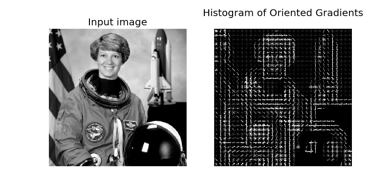</p>
3. Get positive examples:
	* All images in Caltech-cropped-face dataset are used.
	* As each image has its size = 36x36, we directly obtain HOG from the entire image, with HOG setting aforementioned, giving 6x6x31 HOG features for each image. Those features are then flattened to a 1116 vector, representing a cropped face image.
	* Random left-right flip is performed as data augmentation, with randomness follows uniform distribution.
	* Implementation can be found in ```get_positive_features.m```
4. Get negative examples:
	* Random sample from test-scene dataset.
	* Different from obtaining positive examples, images in test-scene dataset have various size, and thus, random crop to size 36x36 is performed before images sent to HOG extractor, with randomness follows uniform distribution.
	* For each random sampled image, HOG features are obtained from cropped image in multi-scale, with level = 3 and scaling rate = 0.7 fixed in my experiments.
	* Random left-right flip is performed as data augmentation, with randomness follows uniform distribution.
	* Implementation can be found in ```get_random_negative_features.m```
5. Support vector machine (SVM):
	* Linear SVM is used to classify positive (face) and negative (non-face) examples (HOG features).
	* Data are random shuffled before training.
	* Implementation utilizes ```vl_svmtrain``` and can be found in ```svm_classify.m```
6. Hard example mining:
	* Both hard positive and negative mining are implemented.
	* We first train SVM classifier with original training dataset, we then make prediction using the trained classifer over training dataset itself and obtain confidence. Both positive and negative examples are sorted according to the confidence and hard positive/negative examples are mined if confidence lower/higher than a threshold.
	* SVM classifier is then trained again with hard examples appended to training dataset.
	* Implementation can be found in ```get_hard_positive.m``` and ```get_hard_negative.m```
7. Detector:
	* We perform sliding window over test images and for each window we obtain HOG features and use SVM classifier to determine whether the window contains a face. All windows are prefiltered by thresholding confidences. Finally, non-maximum suppression is performed to eliminate redundant detections.
	* Sliding window search is runned in multi-scale to figure out faces with various size.
	* Window size is fixed to 36x36.
	* Rather than nested loop structure, sliding window is implemented using Matlab built-in function [blockproc](https://www.mathworks.com/help/images/ref/blockproc.html). This may gain much more efficiency with multi-thread available. The usage is demonstrated as following,
	```
	step = step of sliding window

	block_hog_fun = @(block_struct) vl_hog(block_struct.data, feature_params.hog_cell_size);
	border_size = max(0,round((36-step)/2));
	grid_hog = blockproc(img_downsampled, [step step], block_hog_fun, ...
	                     'BorderSize', [border_size border_size], ...
	                     'PadMethod', 'symmetric', ...
	                     'TrimBorder', false, ...
	                     'PadPartialBlocks', true, ...
	                     'UseParallel', true);
	```
	* Implementation can be found in ```run_detector.m```

### Installation
[VLFeat 0.9.17 binary package](http://www.vlfeat.org/download.html) <br />
[textprogressbar](https://www.mathworks.com/matlabcentral/fileexchange/28067-text-progress-bar) <br />

### How to run
- run ```proj4.m``` will go through entire pipeline above mentioned.
- ```model.mat``` is the trained SVM, w and b, which can be directly used.

### Results

#### Experiments on different scale and sliding window step
|AP<br/>(average precision)|single scale|multi-scale (level=3)|multi-scale (level=6)|
|:---:|:---:|:---:|:---:|
|step=6|0.35|0.71|---|
|step=3|0.43|0.80|0.862|

- Smaller step size for sliding window and more levels for multi-scale bring better performance. However, it costs more computational time.

#### Hard example mining
|before|after|
|---|---|
|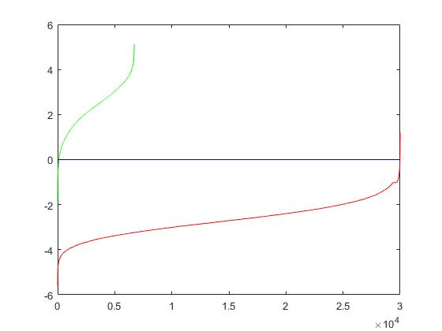|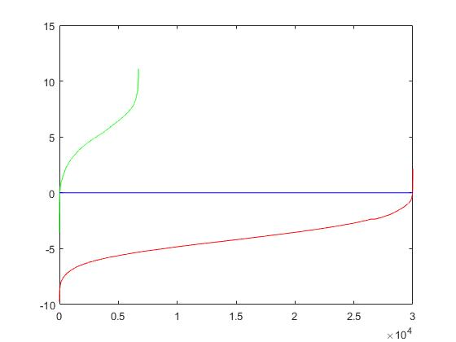|

- Green line is confidence of sorted positive examples; Red line is confidence of sorted negative examples.
- After hard example mining, SVM classifier acquire better discriminative power over positive and negative examples.
- I think using hard example mining may let setting confidence prefilter threshold in detector step become a bit tricky, since it may depend on the threshold of hard positive and negative mining.

#### The following results are done in the following settings
- negative training samples = 20000
- hard positive mining threshold = 1
- hard negative mining threshold = -1
- multi-scale level = 6
- scaling factor = 0.8
- detector confidence prefilter threshold = 1

##### Template HoG visualization
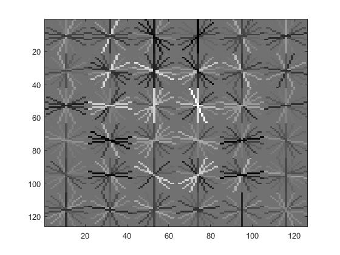

- This a bit look like a face.

##### Precision Recall curve
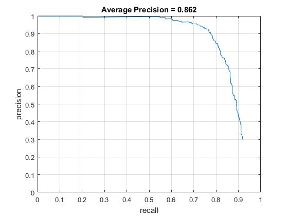

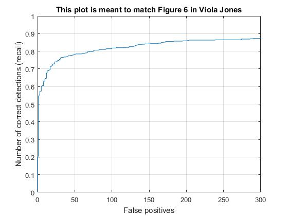

- If we much carfully tune detector confidence prefilter threshold, we may get higher AP.

##### Example of detection on the test set
|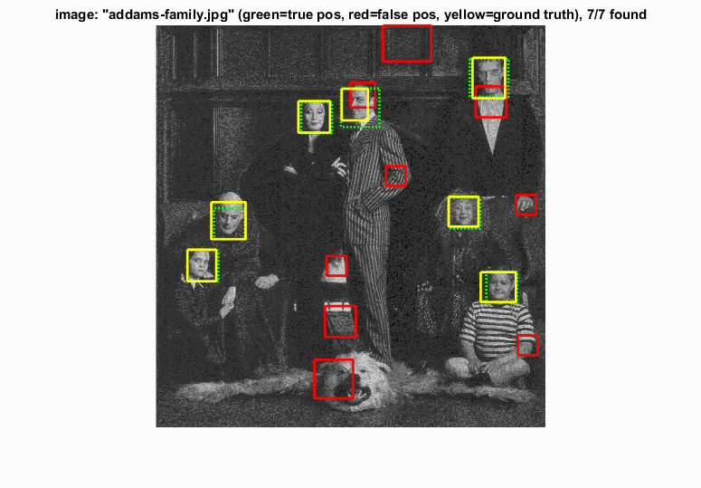|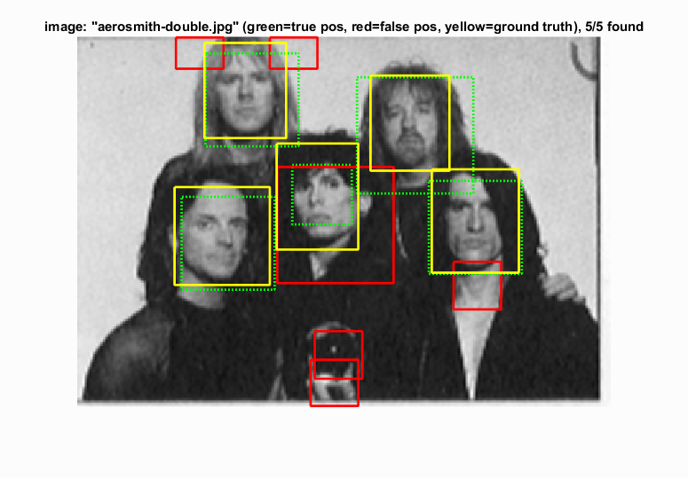|
|---|---|
|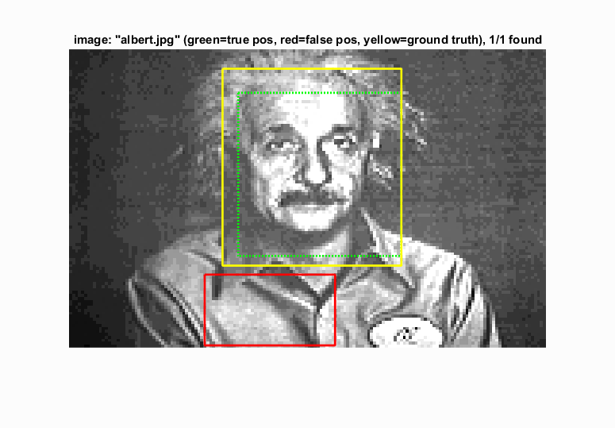|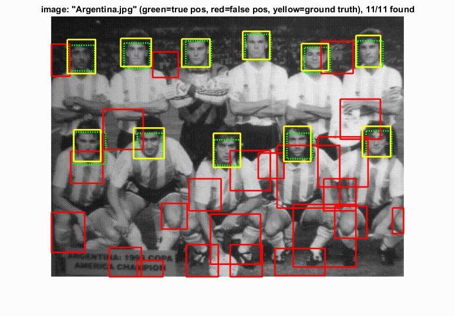|
|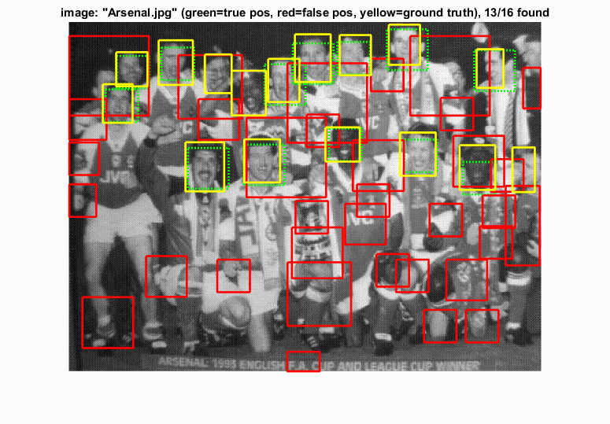|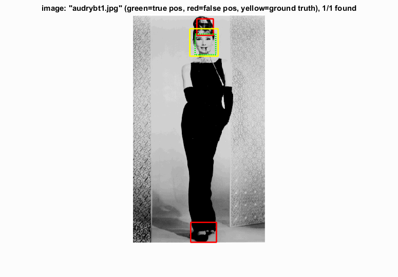|
|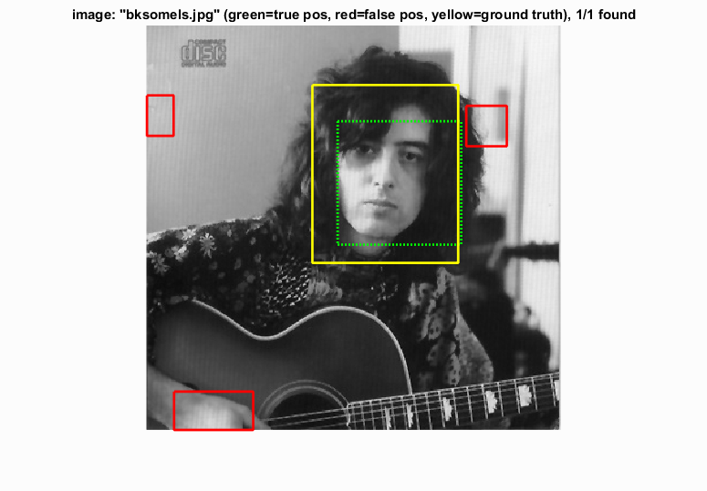|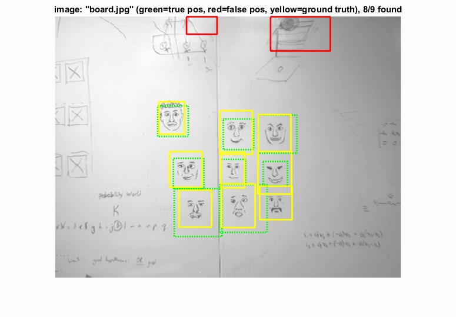|
|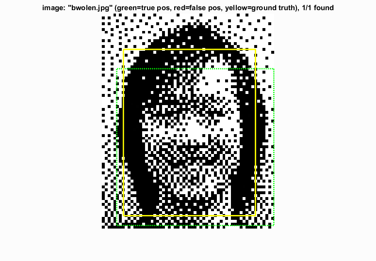|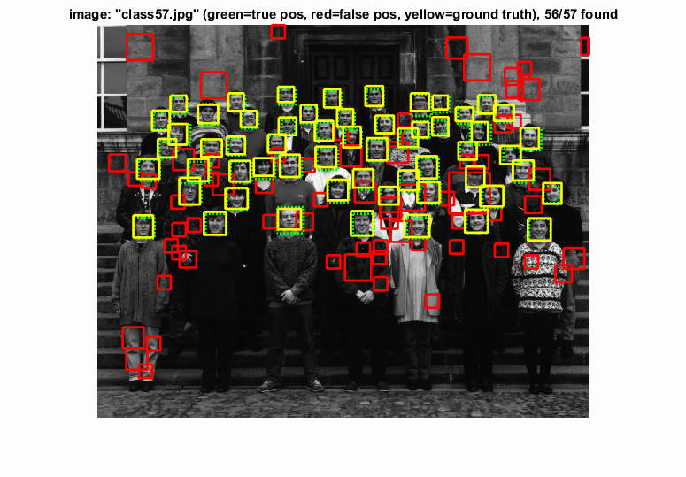|

- for more results, you can go to [here](./img/)
